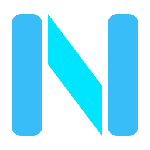
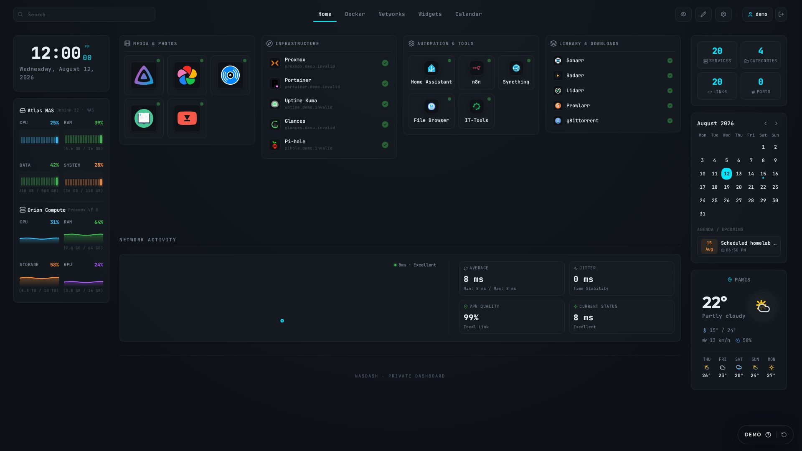
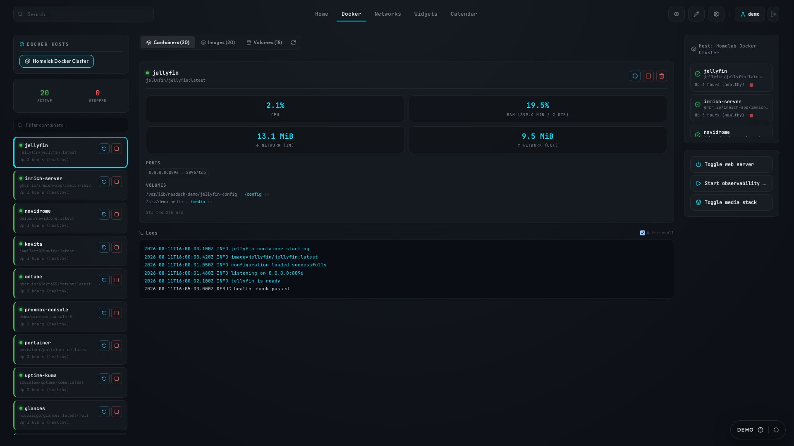
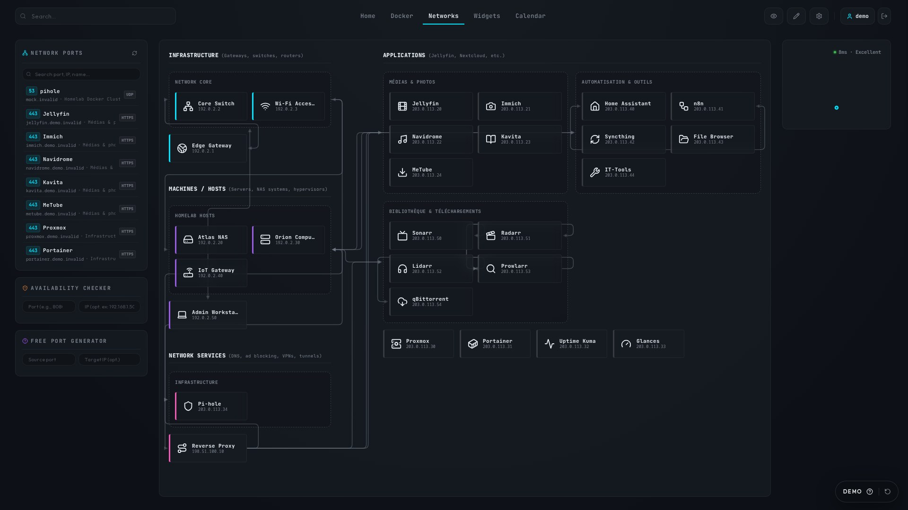
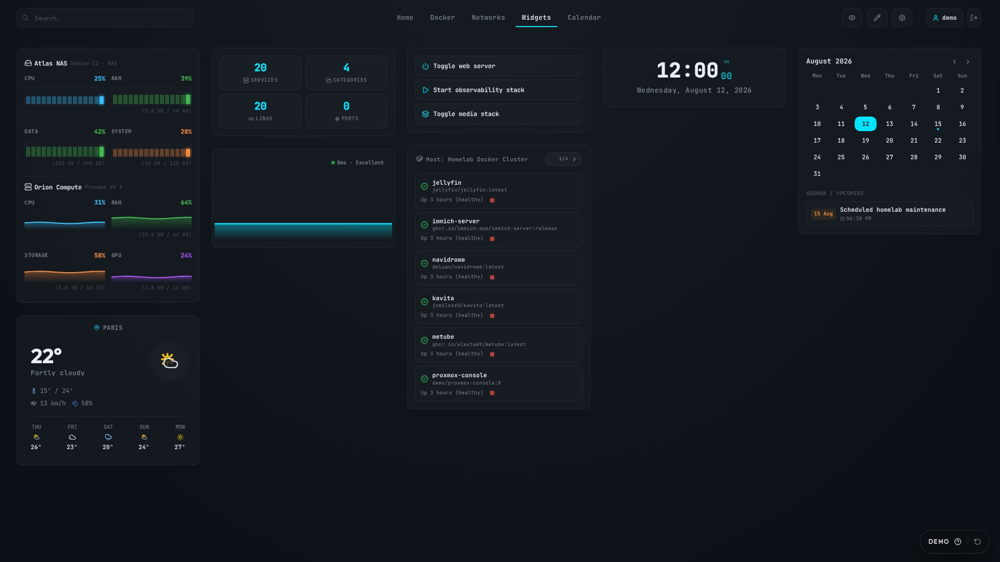
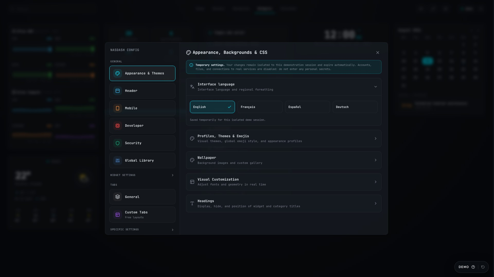
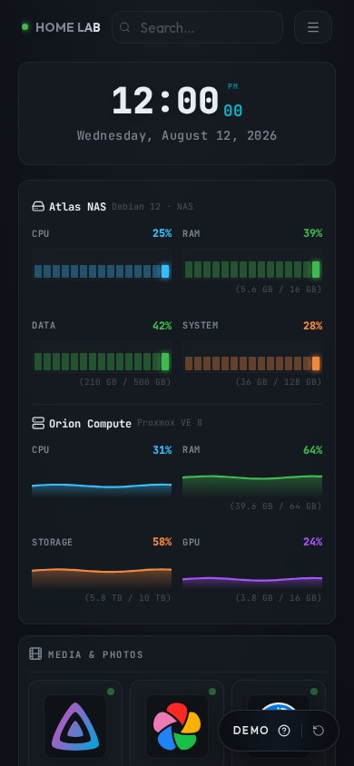
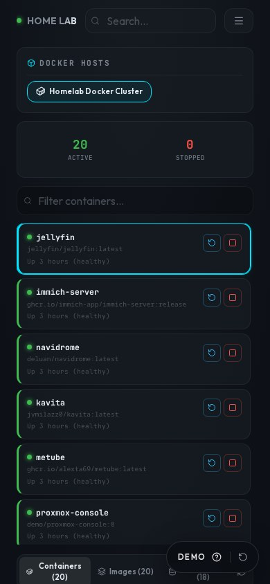

<div align="center">
  
  <h1>NasDash</h1>
  <p><strong>A self-hosted dashboard for homelab services, infrastructure and Docker.</strong></p>

  <p>
    <a href="https://nasdash.lucas-homelab.fr"><strong>Website</strong></a> ·
    <a href="https://demo.nasdash.lucas-homelab.fr"><strong>Live demo</strong></a> ·
    <a href="https://docs.nasdash.lucas-homelab.fr"><strong>Documentation</strong></a>
  </p>

  <p>
    <a href="https://nextjs.org/"></a>
    <a href="https://react.dev/"></a>
    <a href="https://www.typescriptlang.org/"></a>
    <a href="https://www.docker.com/"></a>
    <a href="LICENSE"></a>
  </p>

  
</div>

NasDash brings service links, live availability, server telemetry, Docker management, network topology, Tailscale state, weather and calendar widgets into one configurable interface. Configuration remains on your own server in a persistent Docker volume or bind-mounted directory.

## Product preview

These screenshots are generated from NasDash's isolated public-demo profile. Every service, address, metric and log line is fictional; no personal installation or real infrastructure is connected during capture.

| Docker management and simulated logs | Network topology |
| --- | --- |
|  |  |

<details>
<summary>More views: widgets, settings and mobile</summary>

<p align="center">
  
  
</p>

| Mobile Home | Mobile Docker |
| --- | --- |
|  |  |

</details>

See [DEMO.md](DEMO.md) for the isolation model and [docs/SCREENSHOTS.md](docs/SCREENSHOTS.md) for the reproducible capture workflow.

## Features

- Service categories with local and secondary URLs, live ping and drag-and-drop ordering.
- Hardware metrics from Glances, Home Assistant, Proxmox VE and Libre Hardware Monitor.
- Docker containers, logs, images, volumes and guarded actions through a socket proxy.
- Network topology editor with groups, links and service/device associations.
- Custom tabs, reusable widgets, responsive layouts and appearance profiles.
- Public or private access mode, local admin/viewer accounts and per-viewer allowlists.
- Encrypted integration credentials, atomic configuration writes and local backup/restore tooling.

## Recommended Docker installation

### Requirements

- Docker Engine with Docker Compose v2.
- A Linux host for the bundled Docker socket proxy. Docker Desktop can run NasDash, but the Linux socket mount in the example must be adapted.
- Port `2504` available, or a different host-side port in the Compose file.

### 1. Download the deployment files

```bash
git clone https://github.com/lucas-lepajollec/nasdash.git
cd nasdash
cp .env.example .env
```

New installations should use `docker-compose.named-volume.yml` with the published image `ghcr.io/lucas-lepajollec/nasdash:latest`. The historical `docker-compose.example.yml` remains available for existing `./data` bind-mount installations and is not silently migrated.

### 2. Configure the first login

Edit `.env` and set strong values before the first start:

```dotenv
NASDASH_ADMIN_PASSWORD=replace-with-a-long-unique-password
NASDASH_VIEWER_PASSWORD=replace-with-another-long-password
NASDASH_JWT_SECRET=replace-with-output-from-openssl-rand-hex-32
```

Generate a stable secret with:

```bash
openssl rand -hex 32
```

Keep `NASDASH_JWT_SECRET` stable. Changing it later invalidates sessions and prevents previously encrypted integration credentials from being decrypted. If the values are left empty, NasDash generates passwords and persistent local keys; retrieve the one-time passwords immediately with `docker compose -f docker-compose.named-volume.yml logs nasdash`.

### 3. Start NasDash

```bash
docker compose -f docker-compose.named-volume.yml up -d
docker compose -f docker-compose.named-volume.yml ps
```

Open `http://SERVER_IP:2504`. The example uses the named volume `nasdash-data`, which avoids host UID/GID problems during a first installation.

In NasDash, configure the local Docker host as `docker-proxy` on port `2375`. The proxy is reachable only inside the Compose network and the Docker socket is never mounted into the NasDash container.

### 4. Update safely

Create a backup first, then pull and recreate only the application stack:

```bash
docker compose -f docker-compose.named-volume.yml pull
docker compose -f docker-compose.named-volume.yml up -d
docker compose -f docker-compose.named-volume.yml ps
```

The `nasdash-data` volume is not deleted by these commands. Never use `docker compose down -v` unless you intentionally want to delete all NasDash data. See [BACKUP_AND_RESTORE.md](BACKUP_AND_RESTORE.md) for named-volume and bind-mount procedures.

## Bind-mounted data directory

If you prefer visible host files for NAS snapshots, replace the NasDash volume with:

```yaml
services:
  nasdash:
    volumes:
      - ./data:/app/data
```

Prepare permissions before the first start on Linux:

```bash
mkdir -p data/logos
sudo chown -R 1001:1001 data
```

The application process runs as UID/GID `1001:1001`. The complete directory must remain writable and must be backed up as a unit because it contains configuration, users, password hashes, encryption material and uploaded logos.

## Build from source

The repository `docker-compose.yml` builds the current checkout and keeps data in `./data`:

```bash
cp .env.example .env
mkdir -p data/logos
sudo chown -R 1001:1001 data
docker compose up -d --build
```

For local development, use Node.js `20.9.0` or newer (Node.js 22 LTS is recommended):

```bash
npm ci
cp .env.example .env
npm run dev
```

The development server listens only on `http://127.0.0.1:2499` by default.
To test from another device on a trusted local network, use `npm run dev:lan`
and open the LAN address printed by Next.js.

## Remote Docker hosts

Never publish an unauthenticated Docker API or socket proxy on every network interface. On each remote host, bind the proxy only to a private LAN or Tailscale address and restrict inbound traffic to the NasDash machine:

```yaml
services:
  docker-proxy:
    image: tecnativa/docker-socket-proxy
    restart: unless-stopped
    ports:
      - "100.x.y.z:2375:2375" # Replace with the target host's Tailscale/private IP.
    volumes:
      - /var/run/docker.sock:/var/run/docker.sock:ro
    environment:
      CONTAINERS: 1
      IMAGES: 1
      VOLUMES: 1
      NETWORKS: 1
      INFO: 1
      POST: 1
      DELETE: 0
      AUTH: 0
      BUILD: 0
      EXEC: 0
      SYSTEM: 0
```

Port `2375` is unencrypted and unauthenticated in this configuration. Use a firewall or private overlay network; do not expose it to the internet.

## Proxmox API

Create a dedicated Proxmox API token and grant only the permissions required to read the selected node, VM, container or storage statistics. A read-only role such as `PVEAuditor` is preferable to disabling privilege separation globally. Enter the token ID and secret in the device editor. NasDash supports local self-signed Proxmox certificates.

## Security and operations

- Put NasDash behind HTTPS before exposing it outside a trusted network.
- Keep Docker actions disabled unless they are needed; deletion remains disabled in the example proxy.
- Never commit `.env` or the real `data/` directory.
- Back up the complete persistent data store before updates.
- Report suspected vulnerabilities privately according to [SECURITY.md](SECURITY.md).
- Review [ACCESS_CONTROL.md](ACCESS_CONTROL.md) for the authorization model.
- Review [BACKUP_AND_RESTORE.md](BACKUP_AND_RESTORE.md) before the first upgrade.
- Review [the integration troubleshooting guide](docs/INTEGRATIONS_TROUBLESHOOTING.md) for Glances, Proxmox, Docker and Tailscale diagnostics.
- Review [CUSTOM_CSS.md](CUSTOM_CSS.md) before adding interface overrides and keep the `?safe-css=1` recovery URL available.
- Review [TESTING.md](TESTING.md) for unit, browser and container validation.

## Project layout

```text
NasDash/
├── data/                       # Example files; real runtime data is ignored by Git
├── e2e/                        # Isolated critical browser paths
├── public/                     # Static assets
├── scripts/                    # E2E, container smoke, backup and restore tooling
├── src/app/                    # Next.js pages and API routes
├── src/components/             # Dashboard UI and settings
├── src/lib/                    # Persistence, auth, integrations and contracts
├── docker-compose.named-volume.yml # Recommended new published-image deployment
├── docker-compose.example.yml  # Historical bind-mount deployment
├── docker-compose.yml          # Build-current-checkout deployment
└── Dockerfile                  # Non-root standalone production image
```

## Contributing

Contributions are welcome. Read [CONTRIBUTING.md](CONTRIBUTING.md) and [CODE_OF_CONDUCT.md](CODE_OF_CONDUCT.md) before opening a pull request. NasDash is distributed under the [MIT License](LICENSE).
