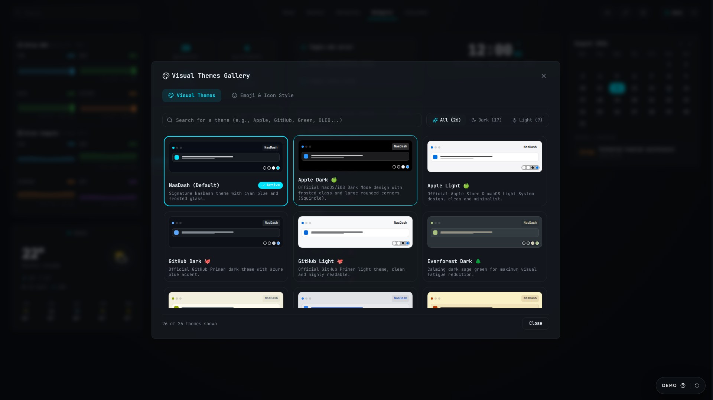
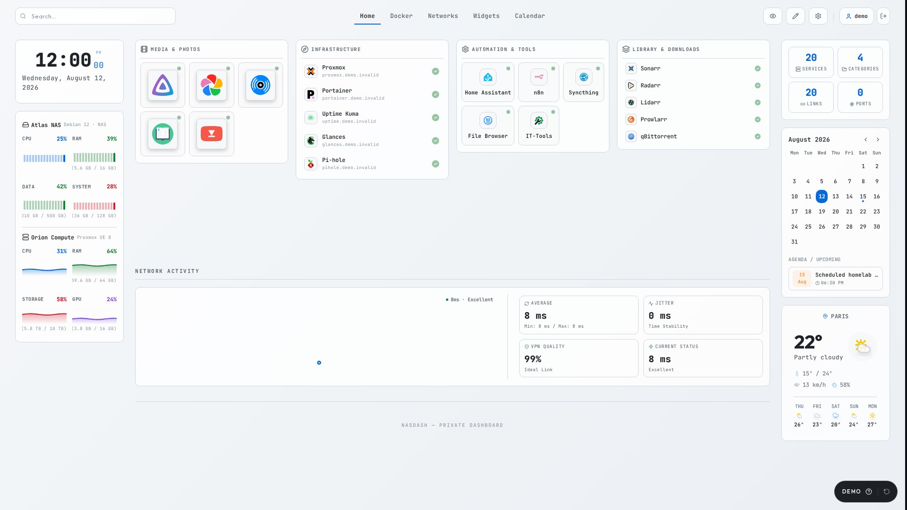
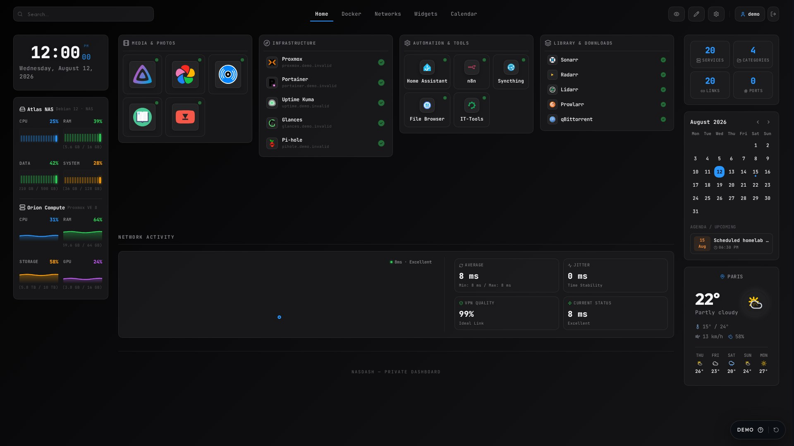
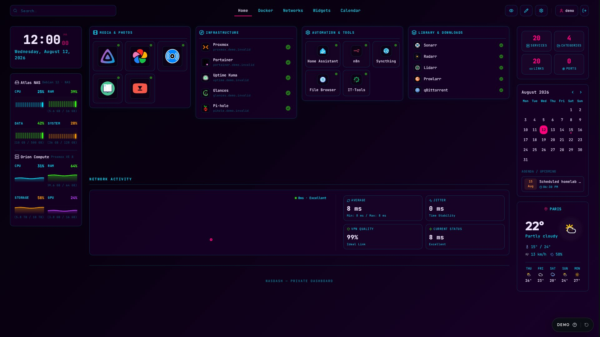
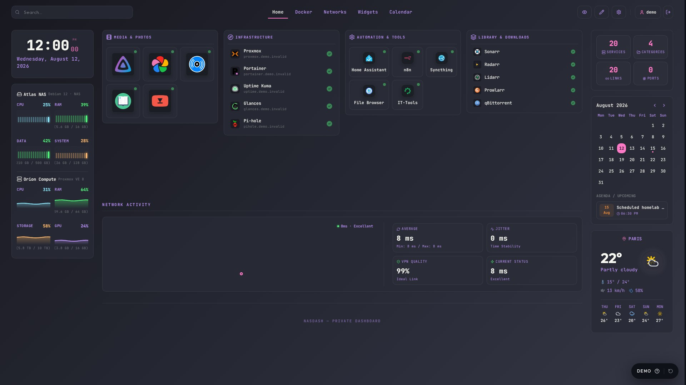
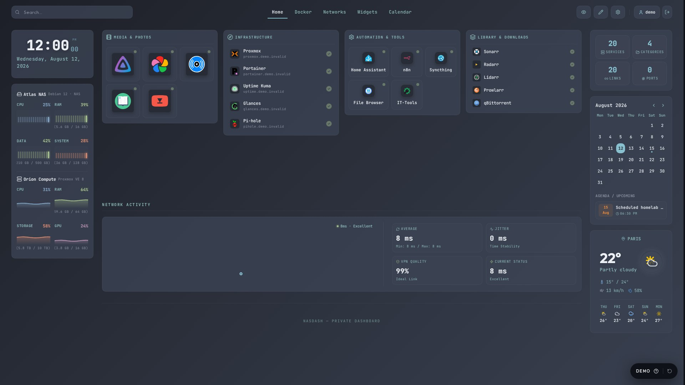
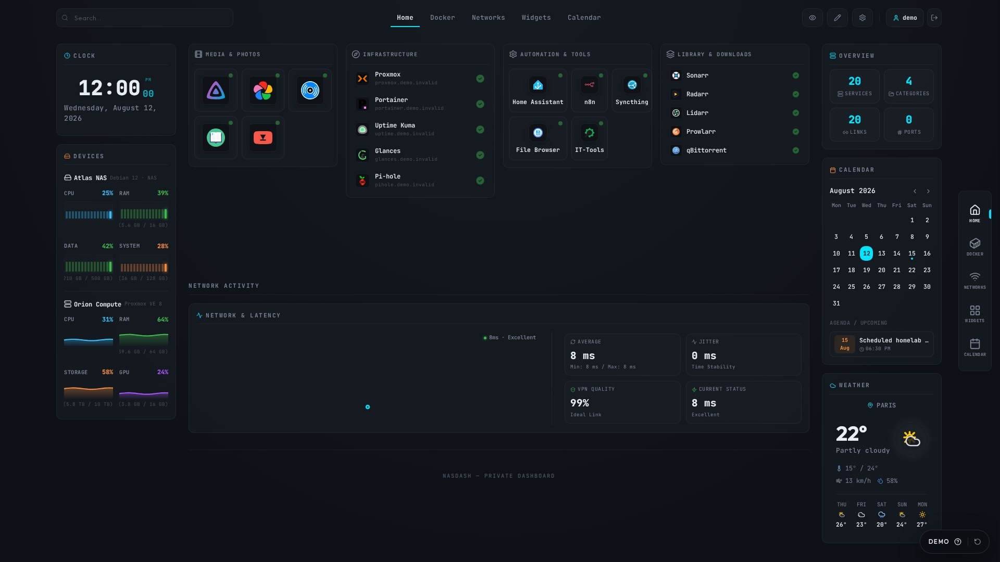

<div align="center">
  
  <h1>NasDash</h1>
  <p><strong>A self-hosted cockpit for homelab services, infrastructure, Docker, telemetry, and network visibility.</strong></p>

  <p>
    <a href="https://nasdash.lucas-homelab.fr"><strong>Website</strong></a> ·
    <a href="https://demo.nasdash.lucas-homelab.fr"><strong>Live demo</strong></a> ·
    <a href="https://docs.nasdash.lucas-homelab.fr"><strong>Documentation</strong></a>
  </p>

  <p>
    <a href="LICENSE"></a>
    
    
  </p>

  
</div>

## Overview

NasDash brings service links, live availability, machine telemetry, Docker management, network topology, Tailscale state, widgets, theming, and local access control into one configurable interface.

Configuration stays on your own server in a persistent Docker volume or bind-mounted directory. Integrations are optional: the dashboard remains useful as a service cockpit while deeper infrastructure capabilities can be enabled deliberately.

## Product preview

Every service, address, metric, and log line below comes from NasDash's isolated public-demo profile. No personal installation or real infrastructure is connected during capture. Screenshots use the English interface with the demo intro dialog closed.

| Docker management and simulated logs | Network topology |
| --- | --- |
|  |  |

| Configurable widgets | Appearance settings |
| --- | --- |
|  |  |

Theme, layout, and visual profiles are first-class product surfaces, not a single default look:

| Visual Themes gallery | GitHub Light |
| --- | --- |
|  |  |

| Apple Dark | Cyberpunk |
| --- | --- |
|  |  |

<details>
<summary>More themes, layout options, and mobile</summary>

| Dracula | Nord |
| --- | --- |
|  |  |

<p align="center">
  
</p>

| Mobile home | Mobile Docker |
| --- | --- |
|  |  |

</details>

## Highlights

- Service categories with local and secondary URLs, live availability, and drag-and-drop ordering.
- Hardware metrics from Glances, Home Assistant, Proxmox VE, and Libre Hardware Monitor.
- Docker containers, logs, images, volumes, and guarded actions through a socket proxy.
- Network topology editor with groups, links, and service/device associations.
- Custom tabs, reusable widgets, responsive layouts, and appearance profiles.
- A complete English, French, Spanish, and German interface with an instance-wide server preference.
- Public or private access mode, local admin/viewer accounts, and viewer allowlists.
- Encrypted integration credentials, atomic configuration writes, and backup/restore tooling.

## Quick start

### Docker Compose

Requirements: Docker Engine with Compose `2.24.0` or newer, a Linux host for the bundled socket proxy, and host port `2504`.

Create `docker-compose.yml`:

```yaml
services:
  nasdash:
    image: ghcr.io/lucas-lepajollec/nasdash:latest
    ports:
      - "2504:2504"
    env_file:
      - path: .env
        required: false
    volumes:
      - ./data:/app/data
    pid: host
    depends_on:
      - docker-proxy
    extra_hosts:
      - "host.docker.internal:host-gateway"
    restart: unless-stopped

  docker-proxy:
    image: tecnativa/docker-socket-proxy:v0.5.0
    volumes:
      - /var/run/docker.sock:/var/run/docker.sock:ro
    environment:
      CONTAINERS: 1
      IMAGES: 1
      VOLUMES: 1
      NETWORKS: 1
      INFO: 1
      POST: 1
      DELETE: 0
    restart: unless-stopped
```

```bash
docker compose up -d
docker compose ps
docker compose logs nasdash
```

No `.env` is required. The first startup prints strong generated passwords once in the logs and stores the account data plus cryptographic keys in `./data`. An optional untracked `.env` can provide advanced overrides. Sign in, change the passwords, then open `http://<server-ip>:2504` from the LAN, or `http://localhost:2504` on the Docker host, and configure the local Docker host as `docker-proxy:2375`. The matching `2504:2504` ports are the Docker host port and container port. Prefer an authenticated HTTPS reverse proxy before leaving a trusted network.

The repository's default Compose file pulls the published image and stores data in `./data`. Do not replace that folder with a named volume on an existing installation: the app would start empty while the real files stay on disk. [`docker-compose.named-volume.yml`](docker-compose.named-volume.yml) is only an optional alternative for a brand-new install. To build the current checkout instead, add [`docker-compose.build.yml`](docker-compose.build.yml):

```bash
docker compose -f docker-compose.yml -f docker-compose.build.yml up -d --build
```

### Local development

```bash
git clone https://github.com/lucas-lepajollec/nasdash.git
cd nasdash
npm ci
cp .env.example .env
npm run dev
```

Development binds to `127.0.0.1:2499` by default. Use `npm run dev:lan` only when deliberately testing on a trusted network.

## Configuration and persistence

- The default `./data` folder contains configuration, users, password hashes, encryption material, and uploaded logos.
- Keep `NASDASH_JWT_SECRET` stable. Changing it invalidates sessions and prevents existing encrypted integration credentials from being decrypted.
- Back up the entire data store before upgrades; never run `docker compose down -v` unless deleting all NasDash state is intentional.
- Before updating, record the current NasDash image digest and run the documented backup. Pull and recreate the stack, then verify `docker compose ps` and `/api/health`. Roll back by changing the `image:` line to the previous version or `sha-<full-commit>` tag and recreating without removing the data directory.
- Make `./data` writable by UID/GID `1001:1001`. Use [`docker-compose.named-volume.yml`](docker-compose.named-volume.yml) only when you deliberately want a named volume instead of a host folder.

See [BACKUP_AND_RESTORE.md](BACKUP_AND_RESTORE.md) for named-volume and bind-mount procedures.

## Security, privacy, and limitations

- Put NasDash behind HTTPS before access leaves a trusted network.
- Never expose an unauthenticated Docker socket or socket proxy to the internet.
- Treat `pid: host`, `CONTAINERS=1`, and Docker socket access as explicit high-risk integration exceptions. The `:ro` socket mount prevents replacing the socket file; it does not make Docker API access read-only. The proxy is not published, destructive deletion is disabled, and only the endpoints required by NasDash are enabled.
- Keep destructive Docker capabilities disabled unless explicitly needed.
- Restrict remote Docker proxies to a private LAN or overlay address and firewall them to the NasDash host.
- Use a dedicated least-privilege Proxmox API token; a read-only role such as `PVEAuditor` is preferable.
- Never commit `.env` or a real runtime `data/` directory.
- Public demo controls and infrastructure data are fictional and isolated.

Read [ACCESS_CONTROL.md](ACCESS_CONTROL.md), [SECURITY.md](SECURITY.md), and the [integration troubleshooting guide](docs/INTEGRATIONS_TROUBLESHOOTING.md) before exposing integrations.

## Architecture

| Layer | Technology |
| --- | --- |
| Application | Next.js, React, TypeScript |
| Persistence and auth | Local server-side data, encrypted credentials, JWT sessions |
| Integrations | Docker proxy, Glances, Proxmox, Tailscale, Home Assistant |
| Deployment | Non-root Docker image and Docker Compose |

```text
src/app/          # Next.js pages and API routes
src/components/   # Dashboard, widgets, settings, and editors
src/lib/          # Persistence, auth, integrations, and contracts
e2e/              # Isolated browser paths
scripts/          # Demo, tests, backup, restore, and smoke tooling
```

## Interface languages

English is the default interface. French, Spanish, and German are maintained alongside it, and the selected language is stored in the server configuration for the whole NasDash instance. The isolated public demo keeps changes temporary and can also receive an explicit `?lang=en`, `?lang=fr`, `?lang=es`, or `?lang=de` handoff.

New interface copy should use a semantic key in `src/i18n/messages.ts`. `src/i18n/generated.ts` is the reviewed migration dictionary for legacy French source phrases; keep its existing keys stable and update all four values together when correcting one of those messages. Use the locale exposed by `useI18n()` for dates, times, numbers, weather lookup, and other regional formatting. User-created names and content remain untouched when no maintained translation exists.

## Development and quality

| Command | Purpose |
| --- | --- |
| `npm run lint` | Run ESLint. |
| `npm run check:i18n` | Verify translation completeness, placeholders, and hard-coded interface copy. |
| `npm test` | Run the Vitest suite. |
| `npm run build` | Create the production build. |
| `npm run test:e2e` | Exercise isolated critical browser paths. |
| `npm run test:container` | Run the production-container smoke test. |
| `npm run demo:capture` | Regenerate the documented demo screenshots. |

See [TESTING.md](TESTING.md) and [docs/SCREENSHOTS.md](docs/SCREENSHOTS.md) for the complete validation and capture workflows.

## Public demo

The [public demo](https://demo.nasdash.lucas-homelab.fr) uses deterministic fictional services, addresses, metrics, logs, and actions. Modifications are temporary and no private Docker host, Tailscale account, or personal infrastructure is reachable. See [DEMO.md](DEMO.md).

## Documentation and community

- [Documentation](https://docs.nasdash.lucas-homelab.fr)
- [Contributing guide](CONTRIBUTING.md)
- [Changelog](CHANGELOG.md)
- [Code of Conduct](CODE_OF_CONDUCT.md)
- [Security policy](SECURITY.md)
- [MIT License](LICENSE)
